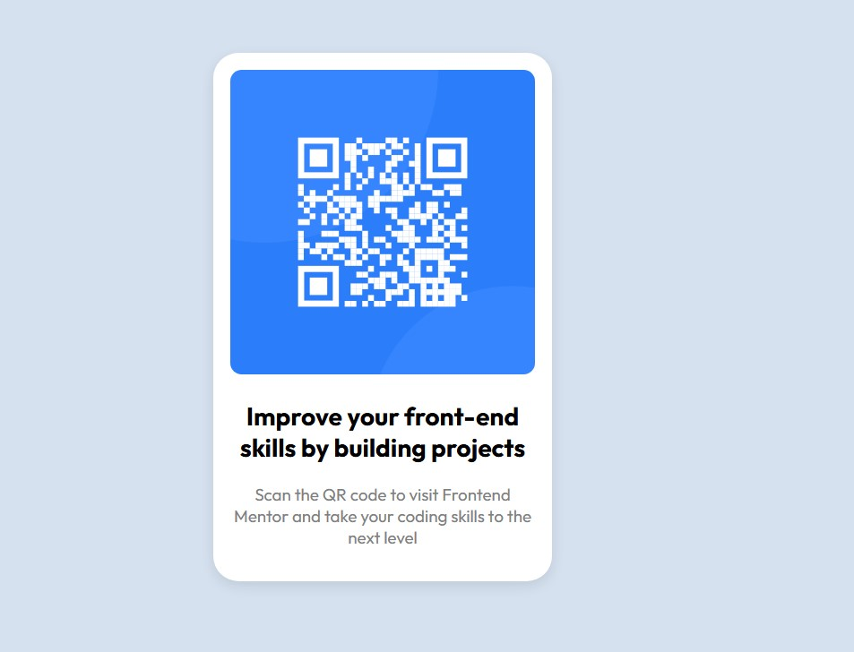

# Frontend Mentor - QR code component solution

This is a solution to the [QR code component challenge on Frontend Mentor](https://www.frontendmentor.io/challenges/qr-code-component-iux_sIO_H). Frontend Mentor challenges help you improve your coding skills by building realistic projects. 

## Table of contents

- [Frontend Mentor - QR code component solution](#frontend-mentor---qr-code-component-solution)
  - [Table of contents](#table-of-contents)
  - [Overview](#overview)
    - [Screenshot](#screenshot)
    - [Links](#links)
  - [My process](#my-process)
    - [Built with](#built-with)
    - [What I learned](#what-i-learned)
  - [Author](#author)

**Note: Delete this note and update the table of contents based on what sections you keep.**

## Overview
  The challenge is to create a card with a QR code, following some style tips and also making it responsive.
### Screenshot




### Links

- Solution URL: [Add solution URL here](https://your-solution-url.com)
- Live Site URL: [Add live site URL here](https://your-live-site-url.com)

## My process

### Built with

- Semantic HTML5 markup
- CSS custom properties
- Flexbox
- Mobile-first workflow


### What I learned

In this simple challenge, I remembered a very important CSS property: [box-sizing](./images/box-sizing.jpg).
The image occupies 100% of the width of the parent element, but the project requires a certain amount of space between the image and the container.
In this case, we could not apply a margin to the image, as it would jump out of the parent element, since no box-sizing configuration includes the element's margin.
Therefore, the best solution was to add padding to the parent element.


To see how you can add code snippets, see below:


```html
  <div class="card">
    <div class="qrcode-wrapper">
      
    </div>
    <h2>Improve your front-end skills by building projects</h2>
    <p> Scan the QR code to visit Frontend Mentor and take your coding skills to the next level
    </p>
  </div>
```
```css
.container-card {
    padding: 7em 0 7em 0;
    
}

.qrcode-img {
    width: 100%;
    border-radius: 10px;
}
```


## Author

- Linkedin - [Jeferson Nascimento](https://www.linkedin.com/in/jeferson-n-75663b145/)
- Frontend Mentor - [@Jeff-Nas](https://www.frontendmentor.io/profile/Jeff-Nas)
- GitHub - [@Jeff-Nas](https://github.com/Jeff-Nas)


